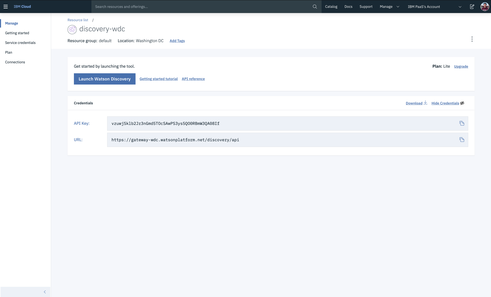

[](https://cloud.ibm.com)
[](https://developer.ibm.com/node/)
[](https://ibm.biz/convite-slack)

# Desafio 02 | FIAP

* [Desafio](#desafio)
* [Avaliação](#avaliação)
* [Comece aqui](#comece-aqui)
* [Pré-requisitos](#pré-requisitos)
* [Criação do Discovery](#criação-do-discovery)
    * [Veja como trabalhar com documentos no Discovery](#veja-como-trabalhar-com-documentos-no-discovery)
    * [Credenciais no Discovery](#credenciais-no-discovery)
* [Aplicação na nuvem](#aplicação-na-nuvem)
    * [Veja como configurar o IBM Continuous Delivery](#veja-como-configurar-o-ibm-continuous-delivery)
* [Submissão](#submissão)
* [Material de Apoio](#material-de-apoio)
* [Dúvidas](#dúvidas)
* [PDF do Desafio](#pdf-do-desafio)
* [License](#license)

## Desafio

A FIAP deseja criar um tutor virtual de matemática para auxiliar as crianças de faixa etária entre 6 e 10 anos.

A ideia é proporcionar uma experiência divertida e atrativa para as crianças, ajudando-as com suas dúvidas e perguntas básicas sobre a matéria, sem que elas mesmo tenham que consultar o material didático. Para isto, o tutor virtual vai dispor de uma base de dados de material didático e de toda tecnologia presente no Watson Discovery.

Um dos exemplos de interação entre as crianças e o tutor é o seguinte:

* A criança quer aprender sobre o conceito de divisão na matemática.
* Ela ingressa através de uma interface e faz a seguinte pergunta: “O que é divisão?”.
* O tutor virtual pesquisa em sua base de dados os documentos que possuem esta resposta e apresenta a passagem do documento que mais atende a dúvida da criança.

Espera-se que o tutor virtual apresente o trecho do documento presente no material didático. A resposta correta para a interação acima seria:

> “Tema: Divisão

> Realizar a divisão de números naturais é o mesmo que repartir em partes iguais os números. Na operação de divisão, o dividendo é como se chama o número a ser dividido, enquanto que o divisor é o número que divide o cálculo e quociente é o resultado da operação. De tal modo que numa divisão temos: 15:3 = 5, uma vez que 3 x 5 = 15. Assim, 15 é o dividendo, 3 é o divisor e 5 é o quociente, esse que representa o número o qual se deve multiplicar pelo divisor para se chegar ao dividendo. E lembre-se: a divisão é a operação contrária da multiplicação. Seu símbolo é representado por ÷, : ou / .",

> Referência: https://www.estudokids.com.br/divisao-o-que-e-e-como-dividir/.”

Uma resposta não tão correta seria o trecho seguinte de um documento: 

> “Tema: Multiplicação

> É uma operação matemática básica que estende o conhecimento da adição para o caso em que as parcelas têm o mesmo valor. Ela é uma evolução natural da adição, pois é definida de modo que represente a soma de determinado número de conjuntos que possuem a mesma quantidade de elementos. Multiplicação é uma maneira que facilita a soma de números iguais. Assim, 2+2+2+2+2=10 é o mesmo que 2x5=10

> Referência: https://brasilescola.uol.com.br/o-que-e/matematica/o-que-e-multiplicacao.htm

> Tema: Divisão

> Realizar a divisão de números naturais é o mesmo que repartir em partes iguais os números. Na operação de divisão, o dividendo é como se chama o número a ser dividido, enquanto que o divisor é o número que divide o cálculo e quociente é o resultado da operação. De tal modo que numa divisão temos: 15:3 = 5, uma vez que 3 x 5 = 15. Assim, 15 é o dividendo, 3 é o divisor e 5 é o quociente, esse que representa o número o qual se deve multiplicar pelo divisor para se chegar ao dividendo. E lembre-se: a divisão é a operação contrária da multiplicação. Seu símbolo é representado por ÷, : ou / .",

> Referência: https://www.estudokids.com.br/divisao-o-que-e-e-como-dividir/”

O trecho acima não está totalmente correto pois apresenta uma resposta muito abrangente e não traz especificadamente a passagem que corresponde a pergunta realizada.

Respostas parciais também serão consideradas como não totalmente corretas, como por exemplo:

> “Tema: Divisão

> Realizar a divisão de números naturais é o mesmo que repartir em partes iguais os números.”

Os temas que fazem parte do escopo do tutor virtual são os seguintes: 

* Operações básicas de matemática, tabuada e sistema de numeração decimal;
* Números naturais, decimais, ordinais, cardinais, romanos, primos e frações;
* Geometria (área, perímetro, reta, segmento de reta, reta numérica, polígonos, poliedros, sólidos geométricos, planificação de sólidos geométricos, vértice, aresta, orientação espacial);
* Conjuntos numéricos e correspondência biunívoca;
* Operações lógicas (classificação, seriação e sequenciação);
* Simetria e gráficos;
* Múltiplos e divisores (máximo divisor comum - MDC e mínimo múltiplo comum - MMC);
* Estimativa, escala e probabilidade;
* Expressão numérica e cálculo mental;
* Tangram;
* Mosaico e tabelas;
* Medida de tempo, massa, peso e grama;
* Ordens, classes e conjuntos;

Portanto, a base de dados de material didático precisa passar por um processo de curadoria. Curadoria é um processo que visa avaliar a qualidade dos dados que serão utilizados para criação do modelo de consulta do Watson Discovery. Ela é importante para garantir que os dados utilizados são de fato úteis a solução e também para evitar processamento e volumetria desnecessários.

A curadoria da base de dados se faz necessária para que apenas os documentos dentro do escopo da solução do tutor matemático sejam carregados. Este procedimento visa garantir a qualidade das respostas apresentadas às crianças. Ela tem como objetivo também a análise dos documentos para viabilizar a quebra dos textos em unidades para possibilitar respostas precisas. Fique a vontade para realizar a curadoria da sua base de dados da maneira que desejar.

O Watson Discovery possui a capacidade de customização de queries de consulta e de treinamento de rankings de documentos. Para que a solução obtenha melhores resultados, é aconselhável (não obrigatório) que sejam criadas queries customizadas e que os documentos tenham seus rankings treinados.

Vale lembrar também que o Watson Discovery permite a criação de um modelo customizado de análise de documentos que serão inseridos em sua base de dados. Então, não esquecer de criar o modelo corretamente para que o(s) arquivo(s) sejam carregados corretamente.

## Avaliação

Os participantes vão receber a base de dados contendo todo material didático a ser utilizado. Este material pode ser utilizado de forma total ou parcial, separado através de um processo de curadoria realizado por cada participante.

Para que os índices de Watson Discovery sejam avaliados, é necessário que cada participante disponibilize as credenciais de acesso (apikey, user, etc) do índice criado. Desta forma, para cada pergunta de teste, a avaliação automática irá avaliar a similaridade entre a passagem recuperada de cada modelo com a passagem esperada como resposta.

Para a etapa de avaliação, não é necessária a implementação de nenhuma interface de conversação para interação com o modelo do Watson Discovery.

## Comece aqui

Para começar no **desafio 2**, você deve seguir item a item abaixo:

1. Leia atentamente o enunciado do [Desafio](#desafio) e a [Avaliação](#avaliação).
2. Siga os [Pré-requisitos](#pré-requisitos) para poder participar do Desafio.
3. Faça as modificações necessárias com o dataset e suba em um [Discovery](#criação-do-discovery) na região de **Washington-DC**.
4. Suba a aplicação na [IBM Cloud](#aplicação-na-nuvem), em **Dallas**, com o serviço do [IBM Continuous Delivery](https://cloud.ibm.com/catalog/services/continuous-delivery) (veja o passo-a-passo abaixo) e configure com as credenciais do Discovery e da Maratona.
5. Submeta o seu desafio, clicando no botão "**SUBMETER DESAFIO**".
6. Pronto! Agora é só acompanhar no ranking (100+).

## Pré-requisitos

Você deverá cumprir os seguintes itens:

- Registrar na [Maratona Behind the Code](https://ibm.biz/maratona) e confirmar o e-mail de cadastro.
- Registrar na [IBM Cloud](https://ibm.biz/BdzsFc) e confirmar o e-mail de cadastro.

## Criação do Discovery

1. Entre na sua conta da [IBM Cloud](https://cloud.ibm.com) e acesse o [catálogo](https://cloud.ibm.com/catalog?category=ai).

2. Localize o serviço de [Discovery](https://cloud.ibm.com/catalog/services/discovery) e clique sobre ele. Não há a necessidade de mudar o nome. Altere a **Região** para **`Washington-DC`**. No desafio, você treinará o Watson nessa região.

3. Clique em "Create" para criar a instância do serviço.

4. Após a criação, clique em "Launch Watson Discovery" para abrir a ferramenta de treinamento. 

5. Crie uma coleção de dados com o upload do(s) documento(s).

**Para ter acesso ao dataset, acesse o [link](doc/source/dataset/documento.docx).**


### Veja como trabalhar com documentos no Discovery

* O que é o Discovery e como fazer a ingestão de documentos na plataforma - https://youtu.be/8TeeqEhuhdU
* Watson Discovery Overview - https://youtu.be/9ks-cEG6KPs
* IBM Watson Discovery: 3 things you want to know - https://youtu.be/q4SVFg6bN5E

### Credenciais no Discovery

Para pegar o IAM_APIKEY (ou API Key apenas). Acesse o seu serviço de Discovery na [IBM Cloud](https://cloud.ibm.com/resources).

<div align="center">
    
</div>

Dentro do seu `Collection`, clique em "API".

<div align="center">
    
    
</div>

## Aplicação na nuvem

Para subir a aplicação na IBM Cloud, você deve clicar no botão abaixo para subir usando o [IBM Continuous Delivery](https://cloud.ibm.com/catalog/services/continuous-delivery) (também conhecido como Delivery Pipeline). **Você deve subir a sua aplicação em Dallas**.

[](https://cloud.ibm.com/devops/setup/deploy?repository=https://github.com/maratonadev/desafio-2)

### Veja como configurar o IBM Continuous Delivery

<!-- Assista o vídeo para aprender a configurar a sua aplicação na IBM Cloud usando o IBM Continuous Delivery, o serviço de DevOps para criar cadeias de ferramentas (ou **toolchains**). -->

1. Configure o `Toolchain Name` com `<maratona-id>-desafio2-behindthecode`, substituindo o `<maratona-id>` pelo seu ID da Maratona (Ex: 100001). Se você não souber, verifique nos emails para pegar o seu ID.

2. Configure o `App name` com a mesmo valor usado no item 1.

3. Crie uma chave (de uso interno). Basta clicar em "Create" e depois clique em "Create" novamente. Espere um instante até carregar todas os dados. Se demorar muito (mais de 5 minutos), recarregue a página e faça novamente o passo 1 e 2. **Na parte inferior (abaixo do item 2), mantenham a Região em Dallas**. 

<div align="center">
    
</div>

Clique em `Eclipse Orion Web IDE` para abrir a IDE para configurar a aplicação, com as credenciais da Maratona e Discovery.

<div align="center">
    
</div>

Abaixo estão o passo-a-passo, obrigatório, para configurar a sua aplicação no [Eclipse Orion Web IDE](https://cloud.ibm.com/docs/services/ContinuousDelivery?topic=ContinuousDelivery-web_ide).

1. Crie o arquivo `.env` para colocar as credenciais do Discovery e da Maratona (lembre-se de que é o mesmo código usado para indicar novos participantes na Maratona). Preencha com os dados, após o *`=`* (símbolo de igua). Lembre-se: o `IAM_APIKEY` é o mesmo que o `PASSWORD` apresentado nas imagens no [Criação do Discovery](#criação-do-discovery)

```
# Credenciais para o Desafio 2
DESAFIO=2
MARATONA_ID=

# Discovery
SERVICE_ENDPOINT=https://gateway-wdc.watsonplatform.net/discovery/api
IAM_APIKEY=
COLLECTION_ID=
CONFIGURATION_ID=
ENVIRONMENT_ID=
```

<div align="center">
    
</div>

2. Abra o arquivo `manifest.yml` e altere o `<maratona-id>` com o seu ID da Maratona, o mesmo usado acima.

```
applications:
- name: <maratona-id>-desafio2-behindthecode
  memory: 256M
  instances: 1
```

<div align="center">
    
</div>

Clique em `Create new launch configuration` e crie a configuração para a sua aplicação (que está sendo criada em *background*). `Launch Config Name`, `Application Name` e `Host` devem ter o mesmo nome, com o formato `<maratona-id>-desafio2-behindthecode`, igual nos itens anteriores. Clique em "Save" para salvar as configurações.

<div align="center">
    
    
</div>

Clique em `Play` (primeiro botão na imagem) e depois, após salvar as configurações e estiver disponível, clique em `Open` (terceiro botão na imagem). Vai abrir a sua aplicação, com o chatbot para você testar e submeter, no final.

<div align="center">
    
</div>

## Submissão

Faça um teste com a sua configuração clicando no botão "TESTE DISCOVERY".

Através da aplicação na IBM Cloud (`https://<maratona-id>-desafio2-behindthecode.mybluemix.net`), você irá clicar no botão **SUBMIT DISCOVERY**, preencher com o seu CPF e enviar para a avaliação final.

<div align="center">
    
</div>

Não iremos divulgar a nota no momento da submissão. Iremos divulgar o ranking dos 100+ colocados.

## Material de apoio

- [O que é a IBM Cloud e como subir a sua primeira aplicação na nuvem](https://medium.com/ibmdeveloperbr/o-que-%C3%A9-a-ibm-cloud-e-como-subir-a-sua-primeira-aplica%C3%A7%C3%A3o-na-nuvem-41bfd260a2b7?source=friends_link&sk=7944d2fe14aa940e9bade68ce0731ba0)
- [Enhance customer help with Smart Document Understanding](https://developer.ibm.com/patterns/enhance-customer-help-desk-with-smart-document-understanding/)
- [Create an app to perform intelligent searches on data](https://developer.ibm.com/patterns/create-an-app-to-perform-intelligent-searches-on-data/)

## Dúvidas

Acesse o slack e mande a sua dúvida: [ibm.biz/convite-slack](https://ibm.biz/convite-slack).

## PDF do Desafio

> Baixe o PDF do desafio [aqui](doc/source/pdf/Storytelling.pdf).

## License

Copyright 2019 Maratona Behind the Code

   Licensed under the Apache License, Version 2.0 (the "License");
   you may not use this file except in compliance with the License.
   You may obtain a copy of the License at

       http://www.apache.org/licenses/LICENSE-2.0

   Unless required by applicable law or agreed to in writing, software
   distributed under the License is distributed on an "AS IS" BASIS,
   WITHOUT WARRANTIES OR CONDITIONS OF ANY KIND, either express or implied.
   See the License for the specific language governing permissions and
   limitations under the License.
